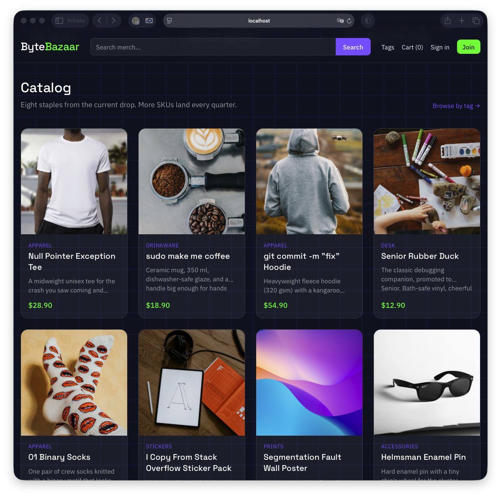
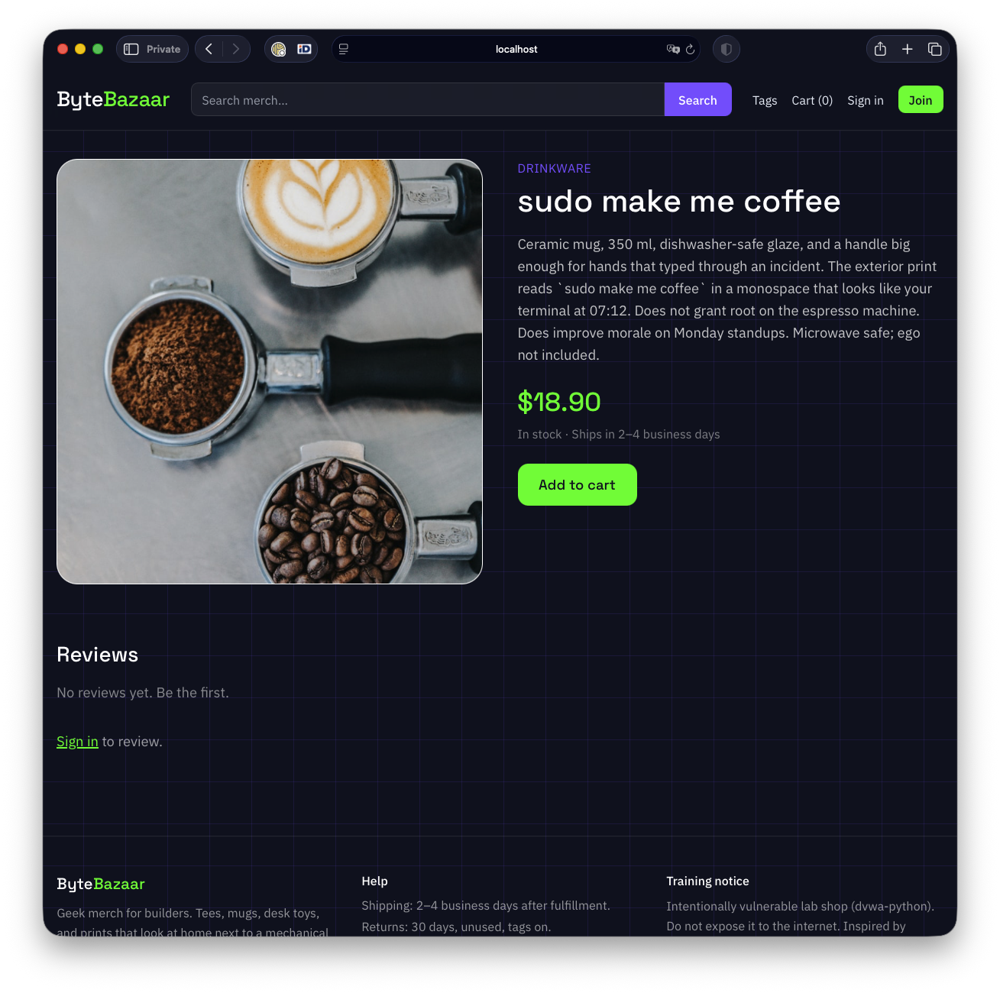
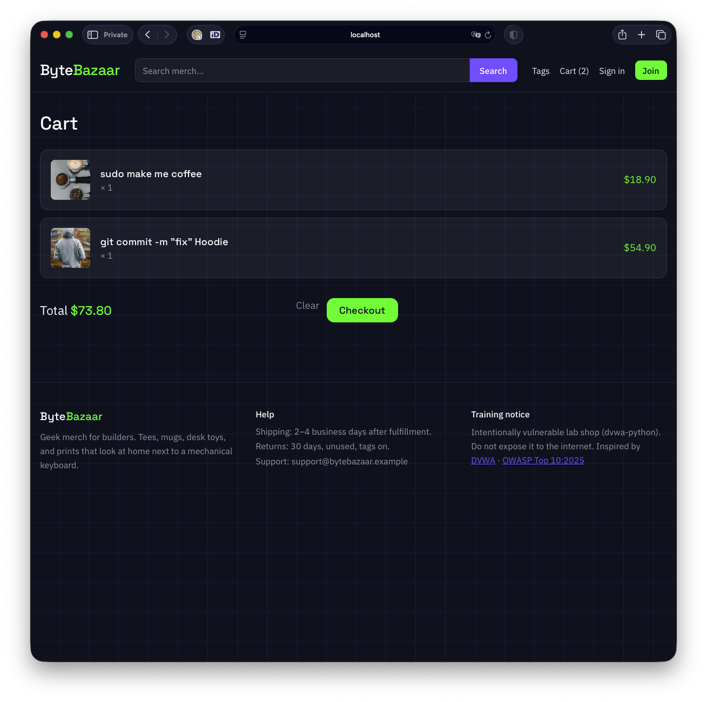
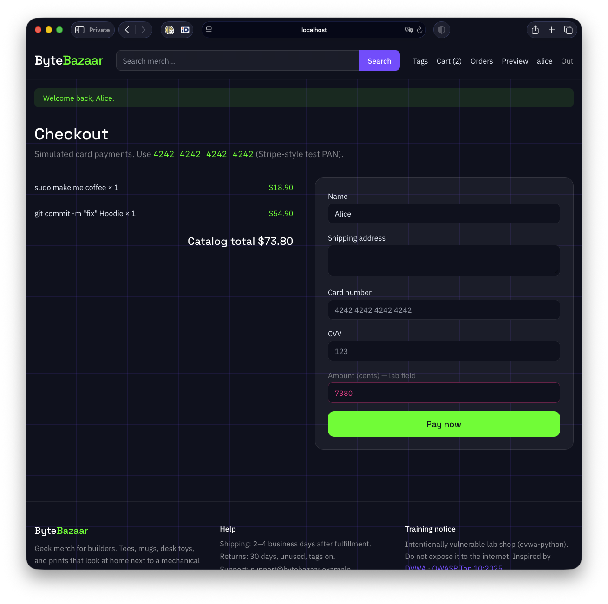
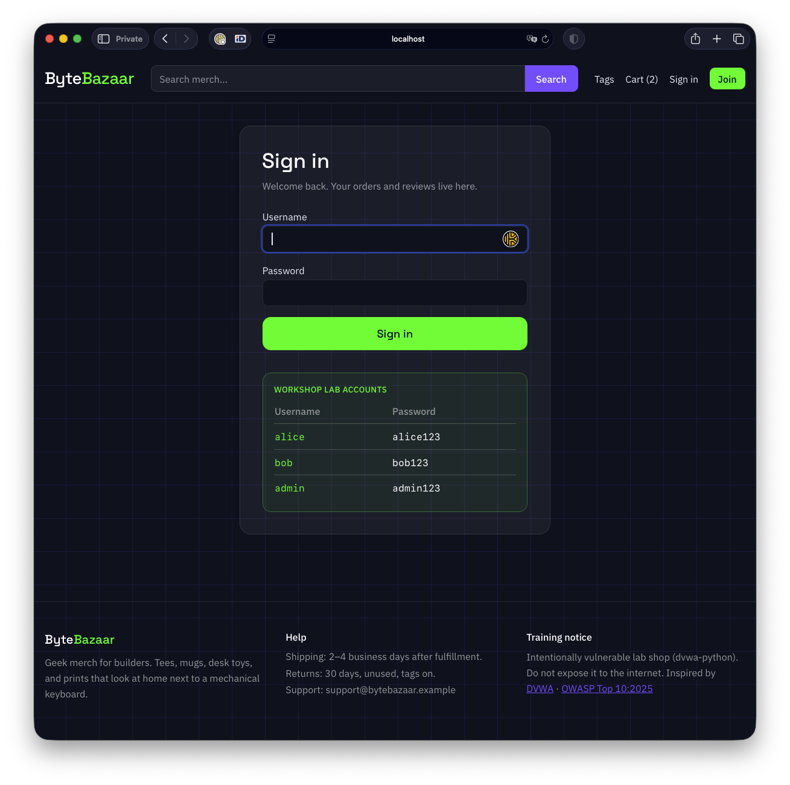

# ByteBazaar

<p align="center">
  <strong>A real geek merch shop that is intentionally full of security bugs.</strong><br/>
  Flask · Postgres · Mongo · Docker Compose · OWASP Top 10:2025
</p>

<p align="center">
  Inspired by <a href="https://github.com/digininja/DVWA">DVWA</a>
  · Author <a href="https://github.com/cr0hn">Daniel García (cr0hn)</a>
  · <a href="LICENSE">MIT</a>
</p>



**This is not a toy mock.** ByteBazaar is a working storefront: catalog, product pages, cart, checkout with a Stripe-style test card, orders, reviews, login, and a small JSON API. The bugs are real code paths against real Postgres and Mongo. When you inject SQL, you hit PostgreSQL. When you SSRF, the app reaches services on the Docker network. Nothing is faked with a hardcoded “hack succeeded” string.

> **Local use only.** Never expose this stack to the internet.

## Screenshots

| Product | Cart | Checkout | Sign in |
|:---:|:---:|:---:|:---:|
|  |  |  |  |

## Why it exists

Most “vulnerable apps” look like demo shells. ByteBazaar looks and behaves like a shop you would ship, then leaves the doors open on purpose so you can practice finding and fixing them.

Every risky spot is marked in the source:

- `VULN:` what is wrong and why it matters
- `SAFE:` what to do instead

You can learn from the UI, from [`docs/labs/`](docs/labs/), or by reading the code next to the bug.

## Quick start

```bash
docker compose up --build
```

Open **http://localhost:8888**

Default host port is `8888` so it does not fight proxies on `8080` (Caido and friends). Override with `APP_PORT=9999` if needed.

You only need Docker. No host Python, Postgres, or Mongo.

Optional: import [`postman/ByteBazaar.postman_collection.json`](postman/ByteBazaar.postman_collection.json) (`baseUrl` = `http://localhost:8888`).

### Lab accounts

| Username | Password  | Role     |
|----------|-----------|----------|
| alice    | alice123  | customer |
| bob      | bob123    | customer |
| admin    | admin123  | admin    |

Test card: `4242 4242 4242 4242`

## Vulnerability map

| # | Vulnerability | OWASP Top 10:2025 | Where | Lab |
|---|---------------|-------------------|-------|-----|
| 01 | BOLA / IDOR on orders | [A01 Broken Access Control](https://owasp.org/Top10/2025/) | `app/routes/orders.py` | [docs](docs/labs/01-bola-idor.md) |
| 02 | SSRF → IMDS → Key Vault | A01 (SSRF) | `app/routes/tools.py`, `mocks/` | [docs](docs/labs/02-ssrf-imds.md) |
| 03 | SQL injection in search | [A05 Injection](https://owasp.org/Top10/2025/) | `app/routes/shop.py` | [docs](docs/labs/03-sqli.md) |
| 03b | NoSQL injection on tags | A05 Injection | `app/routes/shop.py` + Mongo | [docs](docs/labs/03b-nosql.md) |
| 04 | Mass assignment → admin | [A06 Insecure Design](https://owasp.org/Top10/2025/) | `app/routes/account.py` | [docs](docs/labs/04-mass-assignment.md) |
| 05 | Stored XSS + token theft | A05 Injection | reviews + `localStorage` | [docs](docs/labs/05-xss-token-theft.md) |
| 06 | Checkout price tampering | A06 Insecure Design | checkout `amount_cents` | [docs](docs/labs/06-price-tamper-checkout.md) |
| 07 | JWT `alg=none` / weak HMAC | [A07 Authentication Failures](https://owasp.org/Top10/2025/) | `app/authutil.py`, `/api/v1/*` | [docs](docs/labs/07-jwt-alg-none.md) |
| 08 | PAN / CVV stored in clear | [A04 Cryptographic Failures](https://owasp.org/Top10/2025/) | orders / `payment_attempts` | [docs](docs/labs/08-crypto-pan-storage.md) |
| 09 | Debug + verbose errors | [A02 Security Misconfiguration](https://owasp.org/Top10/2025/) / A10 | `FLASK_DEBUG`, search | [docs](docs/labs/09-misconfig-debug.md) |
| 10 | Secrets in application logs | [A09 Logging & Alerting Failures](https://owasp.org/Top10/2025/) | login / payment prints | [docs](docs/labs/10-logging-failures.md) |
| 11 | Poisoned pipeline (PPE) | [A03](https://owasp.org/Top10/2025/) / [A08](https://owasp.org/Top10/2025/) | `azure-pipelines.yml` | [docs](docs/labs/11-ppe-pipeline.md) |
| 12 | Secret still in git history | A02 / A04 | early `.env` commit | [docs](docs/labs/12-secrets-in-git.md) |

Cookie session drives the HTML shop. Broken JWTs are only used under `/api/v1/*`.

Full walkthroughs with short fixes: **[docs/labs/](docs/labs/)**.

## Self-commented code

Open any route under `app/routes/` and search for `VULN:` / `SAFE:`. The teaching note sits next to the line that fails review in real PRs. Example idea:

```python
# VULN (A01 BOLA): login checked, ownership not.
# SAFE: abort unless order.user_id == current_user.id
order = g.db.get(Order, order_id)
```

## Stack

- Python 3.13 + Flask (server-rendered UI + small JSON API)
- PostgreSQL + SQLAlchemy
- MongoDB (tag filter / NoSQL lab)
- Tailwind via CDN
- Docker Compose
- Local Azure IMDS + Key Vault mocks for SSRF

## Azure Pipelines

[`azure-pipelines.yml`](azure-pipelines.yml) at the repo root is the file Azure DevOps would pick up. It is **unsafe on purpose** (PR builds get secrets). Compare with [`pipelines/azure-pipelines.hardened.yml`](pipelines/azure-pipelines.hardened.yml). Do not point either at real credentials.

## Secrets in git

An early commit added a fake `.env` with `AZURE_DEVOPS_PAT`. A later commit removed it from `HEAD`. The value remains in history:

```bash
git log -p --all -S 'AZURE_DEVOPS_PAT' -- .env
```

## Layout

```
app/                 Flask application (commented VULN / SAFE)
mocks/               Fake Azure IMDS + Key Vault
docs/labs/           Short exploit guides + fixes
docs/screenshots/    UI captures for this README
postman/             Postman collection
azure-pipelines.yml  Default ADO pipeline (unsafe on purpose)
pipelines/           Hardened pipeline sample
docker-compose.yml
```

## License

MIT. For learning and local research. Not a real store, even when it looks like one.
